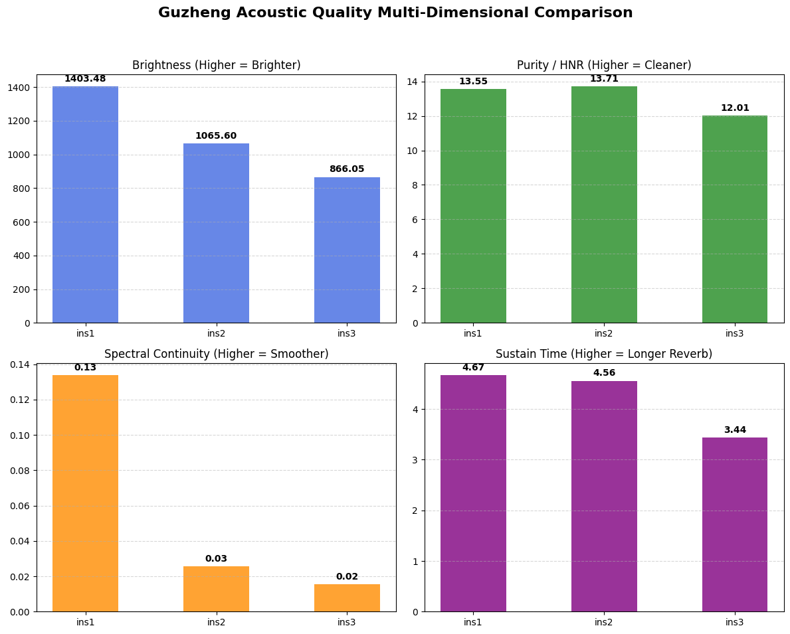

# 🎻 Objective Acoustic Evaluation System for Guzheng Quality

[](https://www.python.org/)
[](https://en.wikipedia.org/wiki/Digital_signal_processing)
[](-)

A rigorous, automated acoustic evaluation pipeline designed to solve a critical industry challenge: **enabling objective, remote instrument quality assessment (Remote Audio Inspection)**. Developed from the perspective of an overseas Guzheng distributor in Sweden, this project bridges subjective luthier craftsmanship with data-driven Digital Signal Processing (DSP) to minimize inventory overhead while ensuring standardized evaluation.

---

## 🎯 1. Background & Business Motivation
In international instrument distribution, evaluating Guzheng quality remotely is notoriously difficult. Traditional reliance on raw audio recordings fails due to:
* **Uncontrolled Acoustic Environments**: Differences in room acoustics and microphone setups render comparison meaningless.
* **Subjective Jargon**: Descriptive words like "bright" or "resonant" lack standardization.
* **High Inventory Costs**: Maintaining extensive physical stock overseas is economically unviable.

**The Solution**: By establishing a standardized recording protocol and an objective automated analysis pipeline, overseas buyers and local dealers can compare new factory samples against known baseline instruments in Sweden through scientific multi-dimensional metrics—eliminating the need for massive local inventories.

---

## 🎙️ 2. Standardized Recording Protocol & Dataset
To eliminate environmental variables, recordings are captured under strict spatial controls with a tiered instrument lineup:

### Instrument Tiers & Physical Specifications
* **`ins1` (1.6m Flagship)**: Standard full-size (163 cm) concert Guzheng, optimized for maximum soundboard resonance and deep low-end sustain.
* **`ins2` (1.0m Mid-Range)**: Compact/travel-sized variant (~1.0m), offering a drier, more focused mid-range tone.
* **`ins3` (0.7m Toy/Mini)**: Ultra-short practice model (~0.7m), serving as a baseline lower-bound for acoustic degradation.


* **Dual-Microphone Setup**: 
  * *Primary Mic*: RODE shotgun directional microphone placed at $50\text{ cm}$.
  * *Secondary Mic*: iPhone 16 Pro placed at $1\text{ m}$ for multi-device cross-validation.
* **Standardized Technique Suite**:
  * **Glissando (`gliss`)**: Rapid sweeps from the lowest to highest register to map full-range frequency characteristics and spectral continuity.
  * **Chord (`chord`)**: Multi-string simultaneous strikes to evaluate attack dynamics and initial energy.
  * **Sustained Notes (`strech`)**: Single-note plucks to capture long-term reverb and decay characteristics (*"Sustain Time"*).

---

## ⚙️ 3. DSP Engineering & Algorithmic Obstacles Overcome
During feature extraction, standard out-of-the-box algorithms proved insufficient, leading to key engineering workarounds:
* **Onset Detection for Glissando**: Standard RMS envelope thresholding ($0.2$ amplitude) failed to capture fast, sweeping glissandos. **Solution**: Implemented a $70\text{ Hz}$ high-pass filter to isolate the fundamental frequencies just below the Guzheng's lowest register, successfully stripping out low-end environmental rumble.
* **Sustain Decay Boundary**: Automated slope-discontinuity algorithms struggled with erratic acoustic tails. **Solution**: Validated via visual inspection and optimized to a standardized $10$-second post-onset sliding window, ensuring robust, repeatable energy decay measurements.

---

## 📊 4. Core Acoustic Metrics & Findings
A dataset comprising 48 audio files across the three instrument tiers was analyzed:

| Instrument Tier | Avg. Brightness (Hz) | Avg. Purity / HNR (dB) | Avg. Continuity (Flatness x1k) | Avg. Sustain Time (s) |
| :--- | :---: | :---: | :---: | :---: |
| **ins1 (1.6m Flagship)** | **1403.48** | 13.55 | **0.1338** | **4.67** |
| **ins2 (1.0m Mid-Range)** | 1065.60 | **13.71** | 0.0256 | 4.56 |
| **ins3 (0.7m Toy)** | 866.05 | 12.01 | 0.0155 | 3.44 |

### Acoustic Comparison Visualizations


---

## 🔬 5. Domain Insights & Physical Hypotheses
An intriguing anomaly emerged: **the 1.0m mid-range instrument (`ins2`) scored slightly higher in HNR purity than the flagship (`ins1`)**. Drawing from years of hands-on performance experience, we hypothesize:
* **String Tension & Transient Friction**: Flagship instruments feature longer scales and higher string tension. During aggressive attacks, artificial nails (*"Yijia"*) generate higher transient friction and non-linear string noise, which HPSS categorizes as percussive energy, slightly lowering global HNR despite superior overall resonance.

---

## 📂 6. Repository Structure
```text
guzheng-acoustic-evaluation/
│
├── README.md                  # Project documentation and findings
├── requirements.txt           # Python dependencies (librosa, numpy, pandas, matplotlib)
├── guzheng_pipeline.py        # Core automated DSP and analysis script
├── guzheng_instruments.jpg    # Physical setup of the 3 instrument tiers
├── plots.png                  # Multi-dimensional acoustic comparison plots
└── output_mp3/                # Processed audio dataset directory (Excluded)
